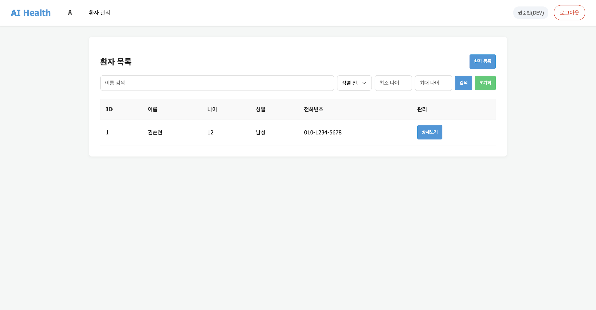
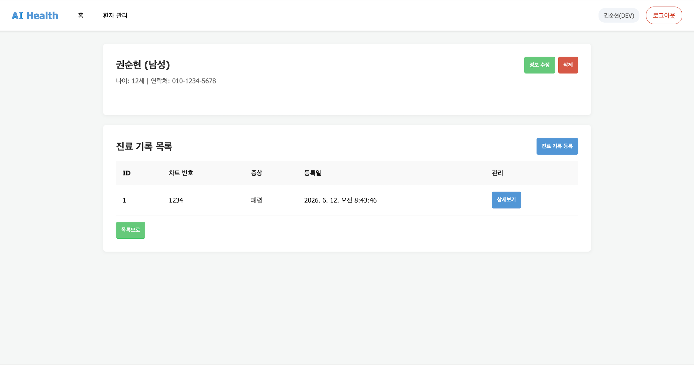
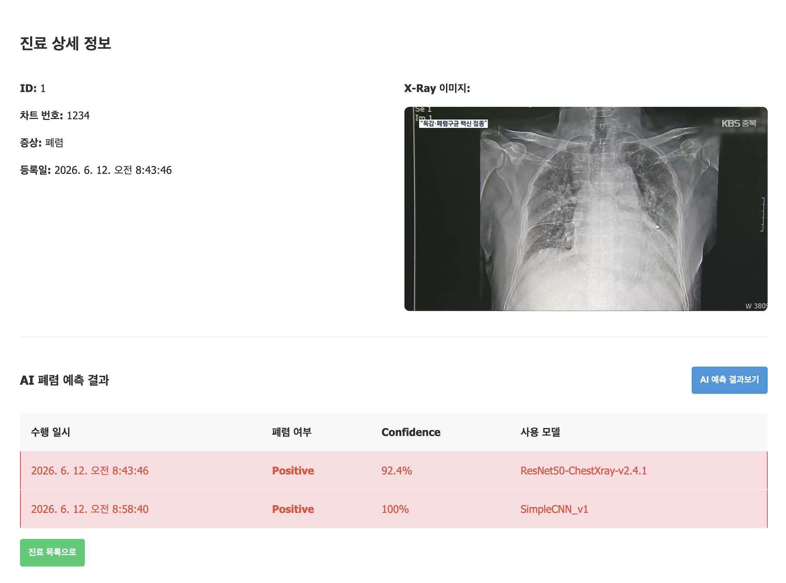

# 🫁 AI Health - 폐렴 환자 관리 백오피스

물리치료사로 10년 넘게 일하다가 의료 AI 분야로 전환하면서 진행한 팀 프로젝트입니다. 병원에서 실제로 느꼈던 불편함들을 떠올리며 기획했습니다. 흉부 X-Ray 이미지를 AI로 분석해 폐렴 여부를 빠르게 확인하고, 환자 정보와 진료기록을 한 곳에서 관리할 수 있는 백오피스 시스템입니다.

---

## 🛠 기술 스택

| 분류 | 기술 |
|------|------|
| Backend | FastAPI, SQLAlchemy, Alembic |
| Database | MySQL, Docker |
| AI/ML | PyTorch, SimpleCNN |
| Frontend | Vanilla JS, HTML/CSS |
| Auth | JWT (python-jose) |

---

## 👥 팀 구성

3명이서 역할을 나눠 진행했습니다. 팀장을 맡아 전체 흐름을 조율하면서 개발도 함께 담당했습니다.

| 이름 | 담당 |
|------|------|
| 권순현 (팀장) | DB 설계 및 마이그레이션, 환자/진료기록 API, AI 예측 API, 프론트엔드 API 연결 |
| 김영현 | 유저 API |
| nobamti | 유저 API |

---

## 주요 기능

로그인한 사용자의 권한에 따라 접근할 수 있는 기능이 달라집니다. 관리자가 승인한 계정만 환자 정보와 AI 예측 기능을 사용할 수 있습니다.

**사용자 관리**
JWT 기반으로 인증을 처리했으며, PENDING / STAFF / ADMIN 세 가지 역할로 권한을 구분했습니다. 신규 가입자는 관리자 승인을 받아야 서비스를 이용할 수 있습니다.

**환자 관리**
환자 등록부터 조회, 수정, 삭제까지 기본적인 CRUD를 구현했으며, 이름/성별/나이로 필터링 검색도 가능합니다.

**진료기록 관리**
진료기록 등록 시 흉부 X-Ray 이미지를 함께 업로드할 수 있습니다. 이미지는 서버에 저장되며, AI 예측에도 바로 활용됩니다.

**AI 폐렴 예측**
SimpleCNN 모델로 X-Ray 이미지를 분석해 폐렴 여부와 Confidence를 반환합니다. 동일한 진료기록에 대한 중복 분석을 방지하는 로직도 포함했습니다.

---

## 📁 프로젝트 구조

```
├── app/
│   ├── apis/          # API 라우터
│   ├── models/        # SQLAlchemy ORM 모델
│   ├── core/          # DB 연결, 설정
│   └── main.py        # FastAPI 앱 진입점
├── worker/
│   └── model.py       # AI 예측 모델
├── static/            # 프론트엔드 (HTML/CSS/JS)
├── docs/              # API 설계 문서 및 실행화면
├── media/             # X-Ray 이미지 저장소
└── docker-compose.yml
```

---

## ⚙️ 실행 방법

```bash
# 1. 환경변수 설정
cp .env.example .env

# 2. Docker로 MySQL 실행
docker-compose up -d

# 3. 서버 실행
uv run uvicorn app.main:app --reload
```

실행 후 http://0.0.0.0:8000 으로 접속하시면 됩니다. API 문서는 http://0.0.0.0:8000/docs 에서 확인하실 수 있습니다.

---

## 📸 실행 화면

### 환자 목록


### 환자 상세 및 진료기록


### AI 폐렴 예측 결과


---

## 📄 API 문서

- [유저 API 설계](docs/4일차_USER_API_설계.md)
- [환자관리 API 설계](docs/5일차_환자관리_API_설계.md)
- [폐렴예측 API 설계](docs/6일차_폐렴예측_API_설계.md)
- [앱 실행화면](docs/7일차_앱_실행화면.md)
