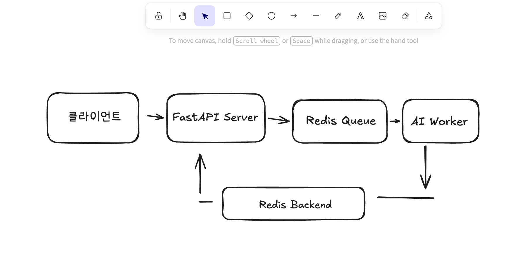

# 9일차 - 동시성 문제 해결을 위한 Event-Driven Architecture 설계

## 1. 개요

FastAPI 기반 폐렴 진단 서비스에서 다수의 사용자가 동시에 X-ray 이미지 분석을 요청할 경우, AI 추론 작업이 동기적으로 처리되면 심각한 성능 저하와 타임아웃이 발생할 수 있다.

이를 해결하기 위해 **Event-Driven Architecture(EDA)** 를 적용하여 FastAPI와 AI 워커의 역할을 분리하고, Redis를 메시지 브로커로 활용한다.

---

## 2. 동시성 문제란?

여러 요청이 동시에 들어올 때 발생하는 문제:

- AI 추론은 CPU/GPU 집약적 작업 → 요청 1건에 수초 소요
- 동기 처리 시 요청이 쌓이면 응답 지연 및 서버 다운
- 다수의 스레드가 공유 자원(모델, DB 연결 등)에 동시 접근 시 Race Condition 발생

---

## 3. Event-Driven Architecture(EDA)란?

시스템 구성 요소들이 **이벤트(메시지)** 를 통해 비동기적으로 통신하는 아키텍처 패턴이다.

### 핵심 구성 요소

| 구성 요소 | 역할 |
|---|---|
| Producer (FastAPI) | 이벤트를 생성하여 큐에 전달 |
| Message Broker (Redis) | 이벤트를 저장하고 워커에 전달 |
| Consumer (AI Worker) | 큐에서 이벤트를 꺼내 처리 |

### 장점

- **비동기 처리**: 요청을 즉시 수락하고 처리는 나중에
- **부하 분산**: 워커를 늘려 처리량 확장 가능 (Scale-out)
- **장애 격리**: AI 워커 장애가 API 서버에 영향 없음
- **재처리 가능**: 실패한 작업을 큐에서 다시 처리

---

## 4. Redis를 활용한 작업 대기열 관리

### Redis Stream이란?

Redis Stream은 이벤트를 **영속적인 로그 형태**로 저장하는 자료구조다. Kafka와 유사하게 Consumer Group을 지원하여 여러 워커가 작업을 분산 처리할 수 있다.

### Redis Stream vs Redis List

| 항목 | Redis List | Redis Stream |
|---|---|---|
| 메시지 영속성 | 소비 후 삭제 | 로그로 영구 보관 |
| Consumer Group | 미지원 | 지원 |
| 메시지 확인(ACK) | 미지원 | 지원 |
| 재처리 | 어려움 | 용이 |

### Celery + Redis 조합

Celery는 Python 분산 작업 큐 라이브러리로, Redis를 브로커(Broker)와 결과 저장소(Backend)로 활용한다.

```
FastAPI → [작업 전달] → Redis(Broker) → Celery Worker → [결과 저장] → Redis(Backend)
                                                                    ↓
                                                              FastAPI가 결과 조회
```

**동작 흐름:**
1. FastAPI가 AI 추론 요청을 받아 Celery 태스크로 등록
2. Redis Broker가 태스크를 큐에 저장
3. Celery Worker가 큐에서 태스크를 꺼내 AI 추론 실행
4. 결과를 Redis Backend에 저장
5. FastAPI가 task_id로 결과를 조회하여 클라이언트에 반환

---

## 5. 폐렴 진단 서비스에 적용한 EDA 설계

### 아키텍처 구성

```
[클라이언트]
    │ POST /ai/predict (X-ray 이미지)
    ▼
[FastAPI Server]
    │ 1. 이미지 저장 (DB/스토리지)
    │ 2. task_id 생성
    │ 3. 작업을 Redis Queue에 Push
    │ → 즉시 { "task_id": "xxx", "status": "pending" } 반환
    ▼
[Redis (Message Broker)]
    │ 작업 대기열 관리
    ▼
[AI Worker (Celery)]
    │ 1. 큐에서 작업 꺼냄
    │ 2. SimpleCNN 모델로 X-ray 추론
    │ 3. 결과를 Redis Backend에 저장
    ▼
[클라이언트]
    │ GET /ai/predict/{task_id} (결과 조회 폴링)
    ▼
[FastAPI Server]
    │ Redis Backend에서 결과 조회 후 반환
```

### FastAPI와 AI 워커의 역할 분리

| 역할 | FastAPI | AI Worker |
|---|---|---|
| 담당 | HTTP 요청 수신/응답, 인증, 유효성 검사 | AI 추론, 결과 저장 |
| 실행 환경 | 비동기(async) 웹 서버 | 독립 프로세스 (Celery) |
| 확장 방식 | API 서버 인스턴스 확장 | 워커 수 확장 |
| 의존성 | 요청 처리에 집중 | AI 모델 로드 및 추론에 집중 |

---

## 6. 아키텍처 도식

> 아래 이미지는 Excalidraw로 작성한 EDA 아키텍처 도식이다.



---

## 7. 핵심 코드 예시

### FastAPI - 작업 등록

```python
from celery import Celery
from fastapi import FastAPI, UploadFile

app = FastAPI()
celery = Celery("tasks", broker="redis://redis:6379/0", backend="redis://redis:6379/0")

@app.post("/ai/predict")
async def predict(file: UploadFile):
    image_data = await file.read()
    task = celery.send_task("tasks.predict_pneumonia", args=[image_data])
    return {"task_id": task.id, "status": "pending"}

@app.get("/ai/predict/{task_id}")
async def get_result(task_id: str):
    result = celery.AsyncResult(task_id)
    return {"task_id": task_id, "status": result.status, "result": result.result}
```

### Celery Worker - AI 추론

```python
from celery import Celery
import torch

celery = Celery("tasks", broker="redis://redis:6379/0", backend="redis://redis:6379/0")
model = SimpleCNN()
model.load_state_dict(torch.load("model.pth"))
model.eval()

@celery.task(name="tasks.predict_pneumonia")
def predict_pneumonia(image_data: bytes):
    tensor = preprocess(image_data)
    with torch.no_grad():
        output = model(tensor)
    return {"prediction": "pneumonia" if output > 0.5 else "normal", "confidence": float(output)}
```

---

## 8. 참고자료

- [How to Use Redis Streams with FastAPI for Event Processing](https://oneuptime.com/blog/post/2026-03-31-redis-fastapi-streams-event-processing/view)
- [FastAPI - Celery로 AI Task 비동기 처리하기](https://velog.io/@nickygod/FastAPI-Celery%EB%A1%9C-AI-Task-%EB%B9%84%EB%8F%99%EA%B8%B0-%EC%B2%98%EB%A6%AC%ED%95%98%EA%B8%B0)
- [Mastering Background Job Queues with Celery, Redis, and FastAPI](https://python.plainenglish.io/mastering-background-job-queues-with-celery-redis-and-fastapi-9eabb97c38af)
